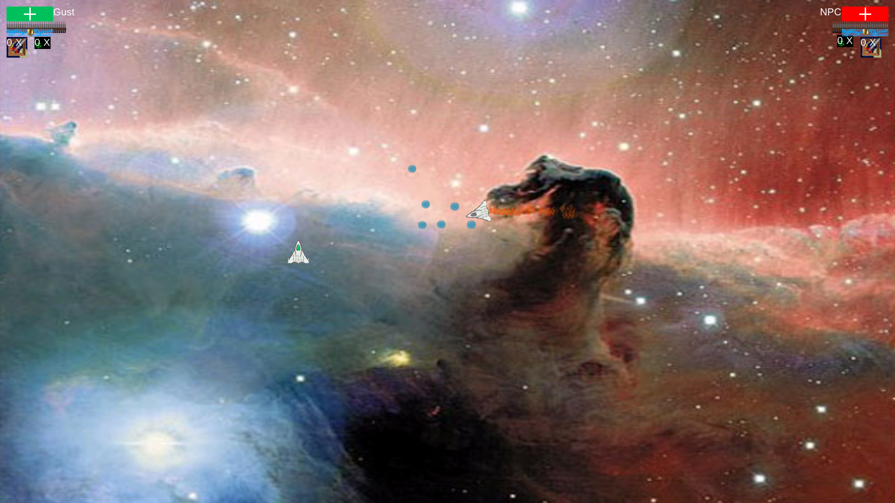
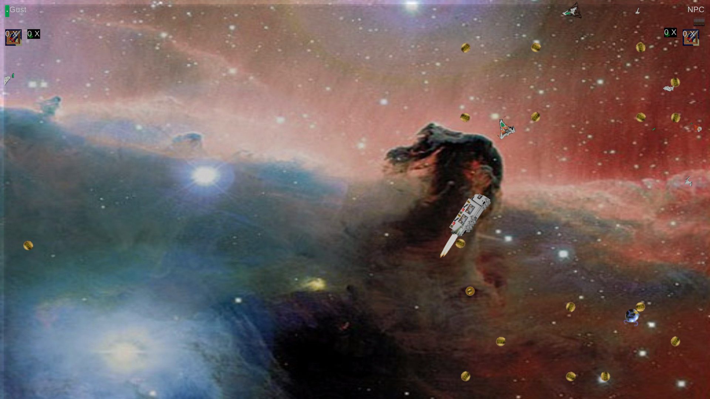

# Gosu Fighters

Gosu Fighters is game I wrote a long time ago (when I was 11) based on
the [gosu](https://github.com/gosu/gosu) library.  T'was a fun project.
Fond memories.

## Gameplay

Two spacecrafts battle each other TO DEATH!  Collect resources from the
resource ship that passes by every once in a while, and distributes health
packages and munitions.  Watch out if your opponent gets a missile!
They're heat seeking missiles and they go BOOM!  They do eventually
run out of fuel, and they can be blown up if shot at (though that's
really hard).

Supports two player same keyboard PVP or single player PVE.  To enable
PVE, click NPC under the options tab.  The AI is not very intelligent,
but beware it is relentless and will give you no reprieve or mercy!

## Screenshots

## Copyright

Copyright André Marçais.  Some of the code may be base on the gosu
tutorial copyright Julian Raschke.  Both codebases are licensed under
the MIT license.  See LICENSE for details.
